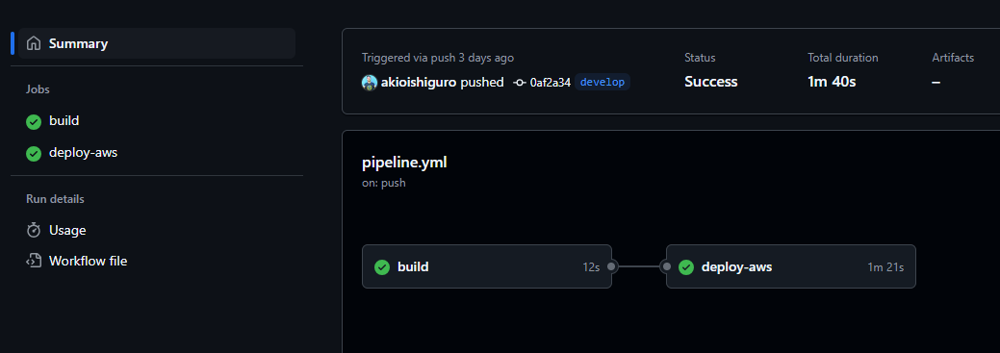
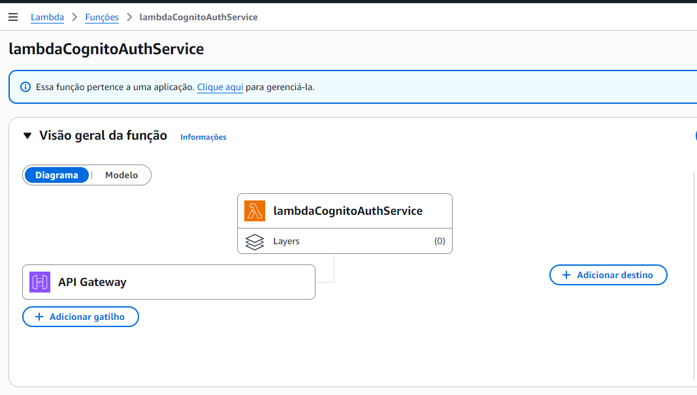

# Lambda Car Market Authenticated API

## Descrição

Esta aplicação foi criada utilizando Python 3.9 e é destinada ao gerenciamento de clientes de um sistema de venda de carros. O código foi desenvolvido para ser executado em uma função AWS Lambda, com o API Gateway da AWS atuando como trigger para as requisições. O sistema é focado na administração de usuários e controle de acessos, utilizando o Amazon Cognito para implementar o gerenciamento de grupos e usuários, garantindo uma abordagem escalável e segura para controle de permissões.

Características específicas do projeto:
- Validação de CPF: O sistema foi projetado para validar o CPF dos usuários antes de realizar operações de criação ou atualização. Caso o CPF seja inválido, o sistema retornará um erro informando que o CPF é inválido.
- Autenticação via CPF: O sistema foi projetado para utilizar o CPF como chave de identificação dos usuários, sem a necessidade de senha, simplificando o processo de login.
- Validação de Tokens: O sistema foi projetado para validar os tokens de acesso antes de permitir o acesso a rotas protegidas. Caso o token seja inválido ou expirado, o sistema retornará um erro informando que o token é inválido.
- Controle de Acesso a Rotas: Foram criadas rotas específicas para operações de criação, atualização e deleção de grupos e usuários. Apenas os usuários autenticados e autorizados possuem acesso a essas rotas. Caso um usuário não autenticado ou não autorizado tente acessar essas rotas, o sistema retornará um erro informando que o usuário não possui permissão para acessar a rota.
- Logs de Auditoria: O sistema foi projetado para registrar logs de auditoria de todas as operações realizadas. Os logs são armazenados no Amazon CloudWatch e contêm informações sobre o usuário que realizou a operação, a data e a hora da operação, o tipo de operação realizada e os parâmetros utilizados na operação.
- Tratamento de Erros: O sistema foi projetado para tratar erros de forma adequada, retornando mensagens de erro claras e informativas para o usuário. Caso ocorra um erro durante a execução de uma operação, o sistema retornará um código de erro e uma mensagem de erro específica para ajudar o usuário a identificar e corrigir o problema.

## Como rodar o projeto
Para rodar o serviço certifique-se de ter o Python 3.9 instalado em sua máquina. Além disso, instale as dependências do projeto utilizando `pip`:
```bash
pip install -r requirements.txt
```
Além disso, é necessário adicionar as variáveis de ambiente que se encontram no arquivo `application.env`. As variáveis de ambiente incluem configurações como região da AWS, ID do pool de usuários, ID do cliente, entre outras.

```env
awsRegion=us-east-1
userPoolId=
clientId=
clientSecret=
awsClientCognito=cognito-idp
groupNameDefault=clients
groupNameAdmin=admin
groupsWithAccessPermissions=['admin','programmatic_user']
```

Com o objetivo de facilitar o testes, o usuario e senha do acesso admin para autenticação é:
```json
{
  "username": "028.567.405-61",
  "password": "3sk^q3xbBAg2@BtJEHWG#%"
}
```

## Deploy na AWS
Toda a esteira de deploy é feita através do gitachub actions, onde o código é enviado para o branch main e automaticamente é feito o deploy na AWS.



Para realizar o deploy na AWS, utilizamos o AWS SAM CLI (Serverless Application Model). O AWS SAM CLI facilita o build e o deploy de aplicações serverless.
Build: Este comando compila o código-fonte e prepara a aplicação para o deploy.
```bash
sam build
```

Deploy: Este comando empacota e faz o deploy da aplicação na AWS.
```bash
sam deploy
```
O comando sam deploy irá guiá-lo através do processo de configuração do deploy, incluindo a criação de um bucket S3 para armazenar o código-fonte e a configuração das permissões necessárias.

```bash
sam local start-api
```
O comando local start-api irá auxiliar na execução do serviço localmente, para testes e validações.


---
Obs: Todos os cpfs utilizados foram gerados através da plataforma de teste: https://www.geradordecpf.org/

